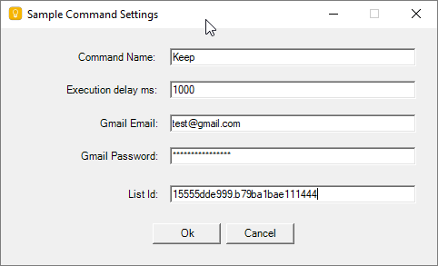

# Google Keep Command for Remote Controller
This is a plugin for https://github.com/karpach/remote-controller.
The command gives an ability to add items to the specified Google Keep list.

Since Google Keep does not provide any public API, the implementation uses Selenium wich Chrome webdriver.

Command Name - a name of the command, gives you an ability to control different Google keep lists.

Execution delay - a delay before command starts its execution.

Gmail Email and Gmail Password are used for Google Keep authorization. Alternatively, you can specify Chrome Profile Folder and manually login to Google Keep in that Chrome Profile.

List Id is the ending part of URL when you click on the Google keep list.

Example:
https://keep.google.com/u/1/#LIST/15660dde079.b79ba1bae1031212

List Id = 15660dde079.b79ba1bae1031212